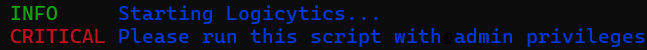
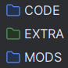
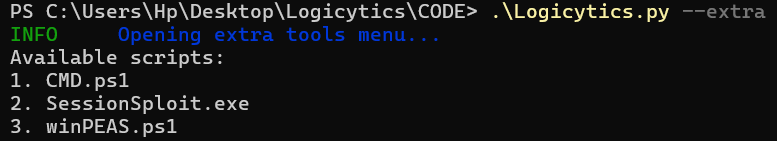

# Logicytics: System Data Harvester 📎

Logicytics is a cutting-edge tool designed to 
meticulously harvest and collect a vast array of Windows system data for forensic analysis.
Crafted with Python 🐍, it's an actively developed project that is dedicated
to gathering as much sensitive data as possible and packaging it neatly into a ZIP file 📦.
This comprehensive guide is here to equip you with everything you need to use Logicytics effectively.

<div align="center">
    <a href="https://github.com/DefinetlyNotAI/Logicytics/issues"></a>
    <a href="https://github.com/DefinetlyNotAI/Logicytics/tags"></a>
    <a href="https://github.com/DefinetlyNotAI/Logicytics/graphs/commit-activity"></a>
    <a href="https://github.com/DefinetlyNotAI/Logicytics/languages"></a>
    <a href="https://github.com/DefinetlyNotAI/Logicytics/actions"></a>
    <a href="https://github.com/DefinetlyNotAI/Logicytics"></a>
</div>
<div align="center">
    <a href="https://www.codefactor.io/repository/github/definetlynotai/logicytics"></a>
    <a href="https://codeclimate.com/github/DefinetlyNotAI/Logicytics/maintainability"></a>
    <a href="https://api.securityscorecards.dev/projects/github.com/DefinetlyNotAI/Logicytics"></a>
    <a href="https://www.bestpractices.dev/projects/9451"></a>
</div>

## ❤️ Support Me ❤️

Please consider buying me a coffee or sponsoring me in GitHub sponsor,
I am saving for my college funds in MIT, and I need your help!
Supporters will be placed in the Credits ❤️

## 🛠️ Installation and Setup 🛠️

To install and setup Logicytics, follow these steps:

1. **Install Python**: If you don't have Python installed, you can download it from the [official website](https://www.python.org/downloads/).

2. **Install Dependencies**: Logicytics requires Python modules. You can install all the required modules by running the following command in your terminal: `pip install -r requirements.txt`

3. **Run Logicytics**: To run Logicytics, simply run the following command in your terminal: `python Logicytics.py -h` - This opens a help menu.

### Prerequisites

- **Python**: The project requires Python 3.8 or higher. You can download Python from the [official website](https://www.python.org/downloads/).

- **Dependencies**: The project requires certain Python modules to be installed. You can install all the required modules by running the following command in your terminal: `pip install -r requirements.txt`.



- **Administrative Privileges**: To be able to run the program using certain features of the project, like registry modification, you must run the program with administrative privileges.

- **System Requirements**: The project has been tested on Windows 10 and 11. It will not work on other operating systems.

- **Knowledge of Command Line**: The project uses command line options for the user to interact with the program. It is recommended to have a basic understanding of command line options.

- **Optional**: Create a `.sys.ignore` file in the `CODE/SysInternal_Suite` directory to not extract the exe binaries from the ZIP file (This is done for the OpenSSF score), if the `.sys.ignore` file is not found, it will auto extract the details

## Step-by-Step Installation and Usage

1) Install Python 🐍
If you don't have Python installed, you can download it from the <a href="https://www.python.org/downloads/">official website</a>.
Make sure to select the option to "Add Python to PATH" during installation.

2) Install Dependencies 📦
Logicytics requires Python modules. You can install all the required modules by running the following command in your terminal:
`pip install -r requirements.txt`

3) Run Logicytics 🚀
To run Logicytics, simply run the following command in your terminal:
<code>python Logicytics.py -h</code>
This opens a help menu.

4) Run the Program 👾
Once you have run the program, you can run the program with the following command:
`python Logicytics.py -h`
Replace the flags with the ones you want to use.
You Must use Admin!

5) Wait for magic to happen 🧙‍♀️
Logicytics will now run and gather data according to the flags you used.

6) Enjoy the gathered data 🎉
Once the program has finished running, you can find the gathered data in the "Data" folder.

7) Share the love ❤️
If you like Logicytics, please consider sharing it with others or spreading the word about it.

8) Contribute to the project 👥
If you have an idea or want to contribute to the project, you can submit an issue or PR on the <a href="https://github.com/DefinetlyNotAI/Logicytics">GitHub repository</a>.


### Basic Usage


After running and successfully collecting data, you may traverse the ACCESS directory as much as you like,
Remove add and delete files, it's the safest directory where your backups, hashes, data zips and logs are found.

Also watch this [video](https://www.youtube.com/watch?v=XVTBmdTQqOs) for a better understanding of Logicytics

## 🔧 Configuration 🔧

Logicytics uses a config.json file to store configurations. The config.json is located in the CODE directory.

The config.json file is a JSON file that contains the following information:

```json
{
    "WEBHOOK URL": "",
    "ipgeolocation.io API KEY": "",
    "DEBUG": true,
    "VERSION": "2.0.0",
    "CURRENT_FILES": [
        "browser_miner.ps1",
        "driverquery.py",
        "log_miner.py",
        "media_backup.py",
        "netadapter.ps1"
    ]
}
```

The config.json file is used to store the webhook URL, 
the API key for ipgeolocation.io, the DEBUG flag, the VERSION, and the CURRENT_FILES.

CURRENT_FILES is an array of strings that contains the names of the files you have, 
this is used to later check for corruption or bugs.

## 🚀 Advanced Usage 🚀



### Mods

Mods are special files that are run with the `--modded` flag.
These files are essentially scripts that are run after the main Logicytics.py script is run
and the verified scripts are run.

They are used to add extra functionality to the script. 
They are located in the `MODS` directory. In order to make a mod, 
you need to create a python file with the `.py` extension or any of the supported extensions `.exe .ps1 .bat`
in the `MODS` directory. 

These file will be run after the main script is run. 
When making a mod, you should avoid acting based on other files directly, 
as this can cause conflicts with the data harvesting. 
Instead, you should use the `Logicytics.py` file and other scripts as a reference 
for how to add features to the script.

The `--modded` flag is used to run all files in the `MODS` directory. 
This flag is not needed for other files in the `CODE` directory to run,
but it is needed for mods to run. 

The `--modded` flag can also be used to run custom scripts.
If you want to run a custom script with the `--modded` flag, 
you can add the script to the `MODS` directory, and it will be run with the `--modded` flag.

To check all the mods and how to make your own, you can check the `Logicytics.py` file and the WIKI.
Also refer to the contributing.md for more info

## 🛑 Troubleshooting 🛑

If you are having issues, here are some troubleshooting tips:

Some errors may not necessarily mean the script is at fault, 
but other OS related faults like files not existing,
or files not being modified, or files not being created.

Some tips are:
- Check if the script is running as admin and not in a VM
- Check if the script has the correct permissions and correct dependencies to run
- Check if the script is not being blocked by a firewall or antivirus or by a VPN or proxy
- Check if the script is not being blocked by any other software or service

If those don't work attempt:
- Try running the script with powershell instead of cmd, or vice versa
- Try running the script in a different directory
- Try running the script in a different computer
- Try running the script with a different python version above 3.8
- Try running the `--debug` flag and check the logs

### Support Resources

Check out the [GitHub wiki](https://github.com/DefinetlyNotAI/Logicytics/wiki) for help

## 📊 Data Analysis 📊


## Data Extraction

Logicytics extracts a wide range of data points on a Windows system.

Here are some of the data points that Logicytics extracts:

Don't recreate these:

<table>
  <tr>
    <th>File Name</th>
    <th>About</th>
    <th>Important Note</th>
  </tr>
  <tr>
    <td>browser_miner.ps1</td>
    <td>Mines all data related to browsers</td>
    <td>Would love to be updated</td>
  </tr>
  <tr>
    <td>driverquery+sysinfo.py</td>
    <td>Gets data from driverquery and sysinfo command</td>
  </tr>
  <tr>
    <td>log_miner.py</td>
    <td>Gets all logs from the Windows device</td>
  </tr>
  <tr>
    <td>media_backup.py</td>
    <td>Gets all media of the device in a neat folder</td>
    <td>Would love to be updated</td>
  </tr>
  <tr>
    <td>netadapter.ps1</td>
    <td>Runs Get-NetAdapter Command with many flags</td>
  </tr>
  <tr>
    <td>online_ip_scraper.py</td>
    <td>Uses https://api.ipify.org to get your IP</td>
    <td>May not be of much use</td>
  </tr>
  <tr>
    <td>property_scraper.ps1</td>
    <td>Gets all the windows properties</td>
  </tr>
  <tr>
    <td>registry.py</td>
    <td>Backups the registry</td>
  </tr>
  <tr>
    <td>sensitive_data_miner.py</td>
    <td>Copies all files that can be considered sensitive in a neat folder</td>
    <td>Must be worked on - Pretty inefficient</td>
  </tr>
  <tr>
    <td>ssh_miner.py</td>
    <td>Gets as much ssh private data as possible</td>
  </tr>
  <tr>
    <td>sys_internal.py</td>
    <td>Attempts to use the Sys_Internal Suite from microsoft</td>
  </tr>
  <tr>
    <td>tasklist.py</td>
    <td>Gets all running tasks, PID and info/data</td>
  </tr>
  <tr>
    <td>tree.bat</td>
    <td>Runs and logs the tree.bat command</td>
  </tr>
  <tr>
    <td>window_feature_miner.ps1</td>
    <td>Logs all the windows features enabled</td>
  </tr>
  <tr>
    <td>wmic.py</td>
    <td>Logs and runs many wmic commands to gain sensitive data and information</td>
  </tr>
  <tr>
    <td>wifi_stealer.py</td>
    <td>Gets the SSID and Password of all saved Wi-Fi</td>
  </tr>
</table>

This is not an exhaustive list, 
but it should give you a good idea of what data Logicytics is capable of extracting.

**Any file with `_` is not counted here, do note they may range from custom libraries to special files/wrappers**

### Want More?

If there is a specific piece of data that you would like to see extracted by Logicytics,
please let us know. We are constantly working to improve the project and adding new features.



Other than mods, some prefixed tools are in the `EXTRA` directory, use the `--extra` flag to traverse these
special tools

### Want to create your own mod?

Check out the [contributing guidlines](CONTRIBUTING.md) file for more info

### Want More?

If there is a specific piece of data that you would like to see extracted by Logicytics,
please let us know. We are constantly working to improve the project and adding new features.


Other than mods, some prefixed tools are in the `EXTRA` directory, use the `--extra` flag to traverse these
special tools

### Want to create your own mod?

Check out the [contributing guidlines](CONTRIBUTING.md) file for more info

## 🌟 Conclusion 🌟

Logicytics is a powerful tool that can extract a wide variety of data from a Windows system.
With its ability to extract data from various sources, Logicytics can be used for a variety of purposes,
from forensics to system information gathering. 
Its ability to extract data from various sources makes it a valuable tool
for any Windows system administrator or forensic investigator.

### 📣 Note

Please remember that extracting data from a system without proper authorization is illegal and unethical.
Always obtain proper authorization before extracting any data from a system.

### 🔗 Links

- [Project's Wiki](https://github.com/DefinetlyNotAI/Logicytics/wiki)
- [Project's License](LICENSE)

### License

- [Developer Certificate of Origin](DCO.md)
- [MIT License](LICENSE.md)


### 📃 GitHub Actions Status

[](https://github.com/DefinetlyNotAI/Logicytics/actions/workflows/github-code-scanning/codeql)
[](https://github.com/DefinetlyNotAI/Logicytics/actions/workflows/codespaces/create_codespaces_prebuilds)
[](https://github.com/DefinetlyNotAI/Logicytics/actions/workflows/dependabot/dependabot-updates)
[](https://github.com/DefinetlyNotAI/Logicytics/actions/workflows/dependency-review.yml)
[](https://github.com/DefinetlyNotAI/Logicytics/actions/workflows/docker-image.yml)
[](https://github.com/DefinetlyNotAI/Logicytics/actions/workflows/greetings.yml)
[](https://github.com/DefinetlyNotAI/Logicytics/actions/workflows/stale.yml)
[](https://github.com/DefinetlyNotAI/Logicytics/actions/workflows/pages/pages-build-deployment)
[](https://github.com/DefinetlyNotAI/Logicytics/actions/workflows/powershell.yml)
[](https://github.com/DefinetlyNotAI/Logicytics/actions/workflows/scorecard.yml)
[](https://github.com/DefinetlyNotAI/Logicytics/actions/workflows/file-mod-restrict.yml)
